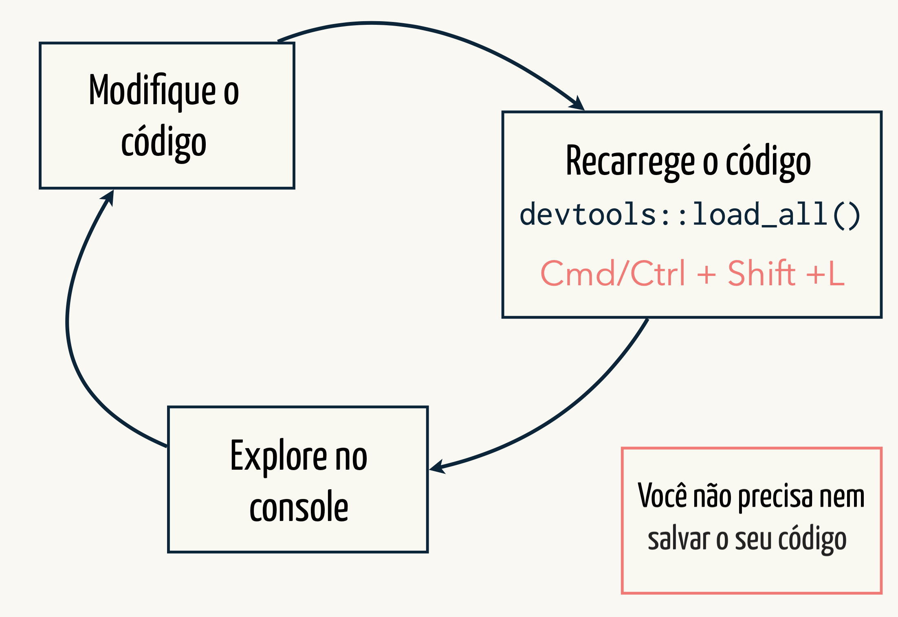
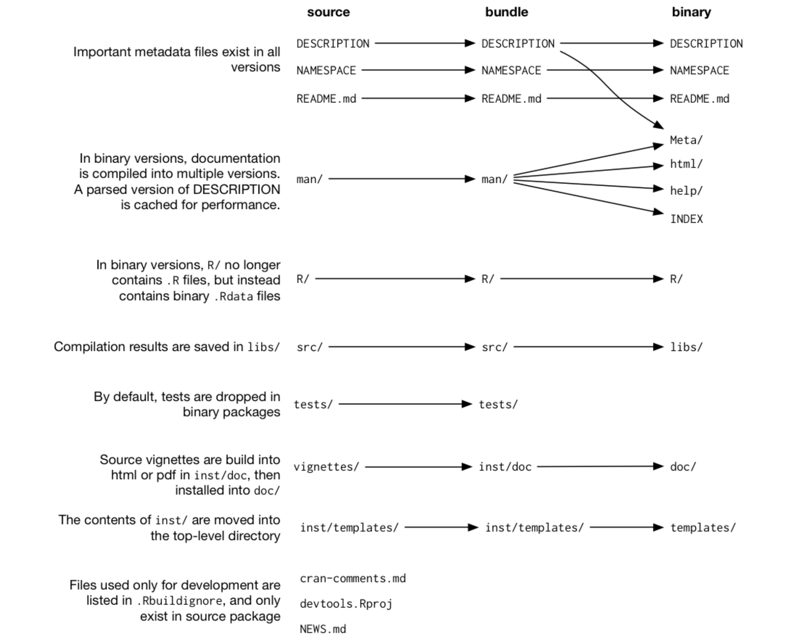

```{r setup, include=FALSE}
options(htmltools.dir.version = FALSE)
```

class: middle, center

# [https://bit.ly/epei2019-pacotes](https://bit.ly/epei2019-pacotes)

---
# Vamos equipar o nosso R para fazermos pacotes

```{r, eval = FALSE}
install.packages(c(
  "devtools", 
  "roxygen2", 
  "testthat",
  "knitr"
))
```

<br>

Ferramentas de desenvolvimento: [http://r-pkgs.had.co.nz/intro.html](http://r-pkgs.had.co.nz/intro.html)

---
# Vamos conhecer mais sobre pacotes!

<br>

> Um pacote é um conjunto de funções que têm como objetivo resolver um problema em específico.

<br>

```{r, eval = FALSE}

# Biblioteca padrão da sua instalação do R
.Library

# Caminho onde o R vai procurar os seu pacotes instalados.
.libPaths()

# Lista os pacotes que você tem instalado
installed.packages()
```

---
# R base

Quando instalamos o R, ele vem com aproximadamente

- 14 pacotes básicos
- 15 pacotes recomendados

Você pode utilizar esses pacotes diretamente, sem instalá-los.

```{r, eval = FALSE}
library(lattice)
```

---
# CRAN

O CRAN é o repositório oficial de pacotes de R com aproximadamente 14 mil pacotes.

Esses pacotes precisam ser instalados (baixar os arquivos do CRAN para o seu computador) e carregados na hora de usar:

```{r, eval = FALSE}
install.packages("tidyverse")
library(tidyverse)
```

---
class: center, middle

# usethis::create_package()
---
class: middle, center
### Vamos criar o pacote "epei2019"

```{r, eval=FALSE}
usethis::create_package(path = "epei2019")
```
---
# Vamos escrever a nossa primeira função

- Todas as funções do nosso pacote devem ser escritas em scripts `.R` dentro da pasta `R/`.

- Podemos usar a função `usethis::use_r("nome-do-arquivo")` para facilitar essa tarefa.

Vamos criar o arquivo `R/read.R`.

```{r, eval = FALSE}
usethis::use_r("read")
```

<br>

Nesse arquivo, vamos construir uma função para ler e empilhar todos os arquivos `.csv` contidos em uma pasta.

---
# Vamos testar a nossa função

- Rodar a função no console `r emo::ji("x")`

- `source("R/plus.R")` `r emo::ji("x")`

- `devtools::load_all()` `r emo::ji("v")`

<br>
<br>
<center style = "color: orange; font-weight: bold;">
ATALHO: CMD/CTRL + SHIFT + L
</center>

---
class: center, middle
### Fluxo de trabalho



---
class: center, middle

# devtools::check()

Avalie a consistência do pacote

Cheque o seu pacote com frequência (não deixe apenas pro final!)

Necessário (mas não suficiente) para o CRAN

<br>
<center style = "color: orange; font-weight: bold;">
ATALHO: CMD/CTRL + SHIFT + E
</center>
---
# DESCRIPTION

- Metadados do seu pacote

- Nela você pode colocar
    - Autores
    - Contato
    - Descrição do pacote
    - Dependências
    - Licensa
    
<br>

Vamos editar o **DESCRIPTION** do nosso pacote.

Para acrescentar uma licensa, podemos usar a função `use_mit_license("Seu Nome")`.
---
class: center, middle

# usethis::use_package()

Defina as dependências do seu pacote

(quais pacotes o usuário precisa ter instalado para o seu pacote funcionar)

---
class: center, middle

# devtools::document()

Documente as suas funções

O pacote `roxygen2` transforma comentários em um `help`

Use a opção *Code > Insert roxygen skeleton* do RStudio para adicionar um esqueleto da documentação.

---
class: center, middle

# usethis::use_test()

Crie testes automáticos para garantir sempre a validade do seu pacote

Rode os testes usando `devtools::test_file()`

---
class: center, middle

# devtools::install()

Transforme seu *pacote fonte* em um pacote instalado

Marca a transição de um pacote em desenvolvimento para um pacote em uso
---
class: center, middle


---
# (Opcional) Vamos criar uma conta no github

.pull-left[
[](https://github.com/)
<center>
<p style = "font-size: 14px">Clique no gato-polvo para entrar no site!</p>
</center>
]

.pull-right[
## Motivos

<h3 style = "color: #007fff">1. Back-up e versionamento</h3>


<h3 style = "color: #007fff">2. Compartilhar o trabalho</h3>


<h3 style = "color: #007fff">3. Disponibilizar o pacote para a comunidade</h3>
]

---
class: center, middle

## Tutoriais

### [Criando repositórios no Github](https://www.curso-r.com/blog/2017-07-17-rstudio-e-github/) `r emo::ji("brazil")`

### [Colocando seu pacote no Github](https://kbroman.org/pkg_primer/pages/github.html) `r emo::ji("us")`
---
class: center, middle

## Mais referências

### [R Packages](http://r-pkgs.had.co.nz/) `r emo::ji("us")`

### [Tutorial rápido para construção de pacotes](https://www.curso-r.com/blog/2017-09-07-pacote-miojo/) `r emo::ji("brazil")`
---
## Praticando

1. Vamos generalizar a nossa função para ler excel e `.rds`.

2. Vamos criar uma função que recebe uma base e devolve o nome das colunas que possuem `NA`.

<br>

- Não se esqueça do fluxo para testar as alterações.

- Rode `devtools::check()` sempre que fizer uma mudança significativa.

- Pense e crie testes automatizados para deixar o seu pacote consistente.


